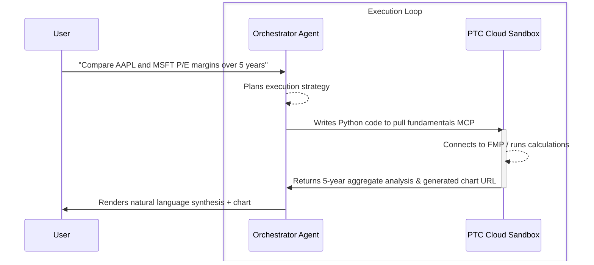
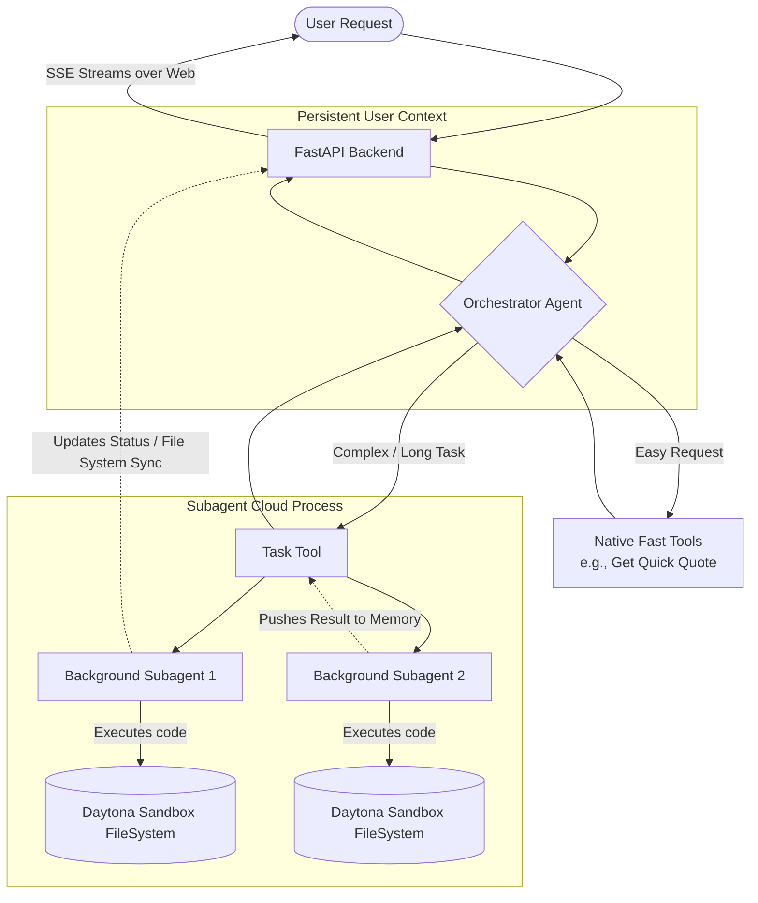
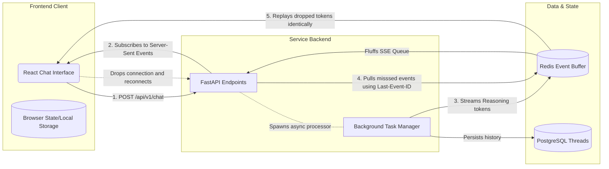

# LangAlpha Architecture Overview

LangAlpha is built as a highly-modular agent network that uses persistent sandboxed environments. This document provides a visual outline (tree structure) of the codebase followed by workflow diagrams mapping out how key features communicate.

---

## 1. Directory Structure (Tree Diagram)

Below is an overview of the key components inside the repository.

```
LangAlpha/
├── src/                                  # Core Python Backend & Agent Engines
│   ├── ptc_agent/                        # The multi-agent cognitive layer
│   │   ├── agent/                        # LangGraph implementation
│   │   │   ├── backends/                 # Checkpointing / state saving logic
│   │   │   ├── middleware/               # Feature injections (FileOps, Caching, Skills, Summarization)
│   │   │   ├── subagents/                # Implementations for threaded, background sub-agent workers
│   │   │   ├── tools/                    # Integrations with built-in tools (todo, etc.)
│   │   │   └── flash/                    # Gemini Flash specific fast-agent handlers
│   │   └── utils/                        # Data formatting and token management
│   ├── server/                           # FastAPI Router & Websocket Backend
│   │   ├── app/                          # API routing (workspaces, threads, chat)
│   │   ├── database/                     # PostgreSQL logic (user data, conversations)
│   │   ├── services/                     # SSE streaming and heavy background task management
│   │   ├── models/                       # Type hints and Pydantic validation
│   │   └── dependencies/                 # API Auth & rate-limiting logic
│   ├── tools/                            # Specialized financial/utility prompt tools
│   │   ├── market_data/                  # Real-time quotes and charting
│   │   ├── sec/                          # SEC filing and document parsers
│   │   ├── search_services/              # Integration with Serper, Tavily, and Bocha
│   │   └── crawler/                      # Web crawling utility
│   ├── llms/                             # Model specific formatting logic
│   └── data_sources/                     # Client abstractions for FMP and external providers
│
├── mcp_servers/                          # Bulk Data Ingestion Sandbox Servers
│   ├── yfinance_mcp_server.py            # Options chains, ESG context
│   ├── price_data_mcp_server.py          # Fast historical OHLCV chart plotting
│   ├── fundamentals_mcp_server.py        # Multi-year accounting data retrieval
│   └── tickertick_mcp_server.py          # Focused ticker news aggregation
│
├── web/                                  # Frontend Workspace UI (React / Vite)
│   └── src/
│       ├── pages/                        # Individual routed application features
│       │   ├── ChatAgent/                # Primary chat interface with SSE listening mechanisms
│       │   ├── TradingCenter/            # Charting and stock overview views
│       │   ├── Dashboard/                # Primary landing and analytics
│       │   └── Automations/              # Workflow definitions
│       ├── components/                   # Reusable UI features (Charts, sidebars, interactive SEC previews)
│       └── contexts/                     # Global state hooks
│
├── libs/                                 # Packaged Libraries and Command Line
│   ├── ptc-agent/                        # Re-packaged iteration of the agent core
│   └── ptc-cli/                          # Developer terminal access with sandbox execution tracking, etc.
│
└── skills/                               # Dynamic Extensibility Plugins
    ├── automation/                       # External process integrations
    ├── creating-financial-models/        # Deep reasoning paths
    ├── docx/, pdf/, pptx/, xlsx/         # Intercept protocols for specialized file parsing
    └── user-profile/                     # Long-term preference ingestion
```

---

## 2. Key Workflow Diagrams

The system operates across a **Client**, **Gateway**, **Agent (LangGraph)**, and **Sandbox** boundary. The below Mermaid graphs define how the central mechanics are orchestrated.

### 2.1 The Agent Reasoning Loop (PTC Cycle)

The primary interaction style of LangAlpha is the Plan-Think-Code cycle. Rather than pushing giant datasets to the LLM, the LLM requests data via code.



---

### 2.2 Subagent Swarm Execution

To protect the main agent's context window during extended research tasks, the application spins off background operations.




### 2.3 Streaming and Reconnection Architecture

Because of the massive amount of computational hopping, typical HTTP `request -> wait -> response` patterns fail. LangAlpha implements a highly resilient State-Synced Event pattern.


